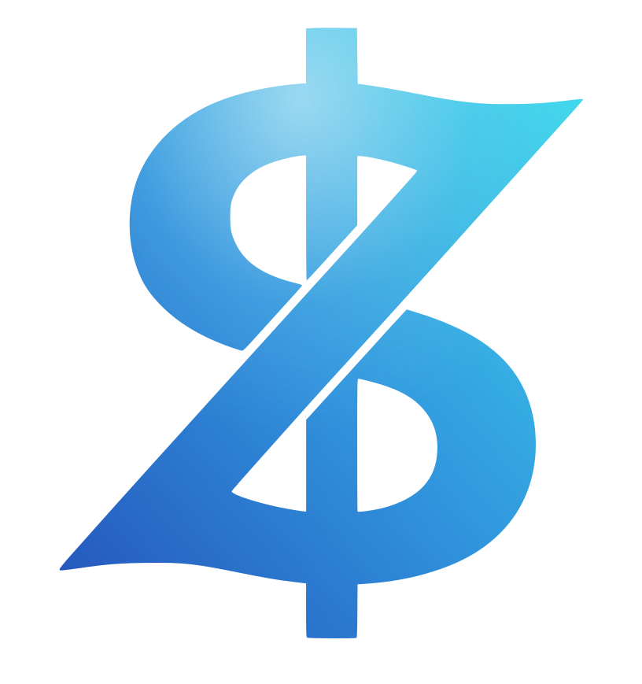
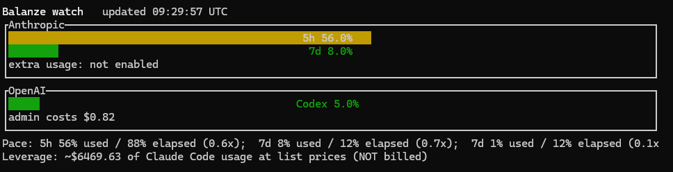

<p align="center">
  <picture>
    <source media="(prefers-color-scheme: dark)" srcset="docs/assets/logo-white.svg">
    
  </picture>
</p>

<h1 align="center">Balanze</h1>

<p align="center">
  <a href="https://github.com/Oszkar/balanze/actions/workflows/ci.yml"></a>
  <a href="https://github.com/Oszkar/balanze/tags"></a>
  <a href="LICENSE"></a>
  <a href="Cargo.toml"></a>
</p>

<p align="center">
  A local-first tray utility that consolidates personal AI usage into one normalized view - Claude subscription quota, an estimate of Claude Code's API-rate value, OpenAI Codex quota, and real OpenAI API spend, all at a glance.<br>
  Rust + Tauri 2 + Svelte 5. Windows 11 and macOS 15+ (the CLI also runs on Linux).
</p>

> Not affiliated with, endorsed by, or sponsored by Anthropic or OpenAI. Reads only endpoints and files you already have access to with your own credentials.

<p align="center">
  
</p>
<p align="center"><sub><code>balanze-cli watch</code> - a live, bounded TUI showing Anthropic and OpenAI usage side by side.</sub></p>

<!-- TODO (v0.5 "Legibility", see docs/PRD.md): feature a tray-popover screenshot / short GIF here as the primary hero (the popover is the flagship surface; the TUI above is the CLI stand-in). Capture states via `bun run gallery` / `bun run gallery:snap`, or grab the live app; drop the asset in docs/assets/ and swap it in above the TUI. -->

## What it does

Balanze surfaces one normalized snapshot two ways - the `balanze-cli` CLI and a **tray popover** (a color-shifting gauge icon, a glanceable grid/cards view, and a settings panel for keys and provider toggles). Both render the same data, and that data holds **measured reality only** - server-reported quota % and real billed $ - so every cell in a column is the same *kind* of number:

|               | Quota %                              | API $ (real billed)                                 |
|---------------|--------------------------------------|-----------------------------------------------------|
| **Anthropic** | OAuth usage (5h / 7-day / per-model) | `extra_usage` overage if you enabled it, else *n/a* |
| **OpenAI**    | Codex CLI rate-limit %               | real billed spend (Admin Costs API)                 |

The Claude list-price figure is deliberately **not** a matrix cell - it lives outside the grid as a separate *Subscription leverage* insight (below), so a counterfactual estimate can never be mistaken for billed spend.

- **Anthropic quota** - the same `/api/oauth/usage` endpoint Claude Code uses: live 5-hour / 7-day / per-model bars with `resets_at` clocks. No scraping.
- **Anthropic API $ - real or nothing.** Anthropic exposes no per-user API spend, so this cell shows the real `extra_usage` pay-as-you-go overage *if* you enabled it on claude.ai (the same billed cents claude.ai's overage meter shows), and otherwise reads as **not available** - never backfilled with a substitute number.
- **OpenAI Codex quota** - the server-computed `rate_limits.primary` %, read from the local Codex CLI rollout files (`~/.codex/sessions/`).
- **OpenAI API $** - this-month spend plus a per-line-item breakdown from `/v1/organization/costs`, using an `sk-admin-...` key. Real billing data.
- **Subscription leverage (a separate estimate)** - `claude_cost` multiplies your local Claude Code JSONL by a vendored LiteLLM price table to show what that usage *would* cost at API list prices. For Pro/Max users that is leverage from the subscription, **never billed** - so it sits outside the matrix as its own insight.

Roadmap and phase detail live in [`docs/PRD.md`](docs/PRD.md); architecture and the twelve boundaries in [`docs/ARCHITECTURE.md`](docs/ARCHITECTURE.md); release history in [`CHANGELOG.md`](CHANGELOG.md); code discipline in [`AGENTS.md`](AGENTS.md); common gotchas in [`docs/TROUBLESHOOTING.md`](docs/TROUBLESHOOTING.md); security posture in [`docs/SECURITY.md`](docs/SECURITY.md).

## Install

Balanze currently ships **from source only** - no prebuilt binaries, installers, or crates.io release yet (signed binaries, Homebrew, and WinGet are on the [roadmap](docs/PRD.md)). Requires Rust 1.85+.

```bash
# `--git` is required (not on crates.io). The repo root is a virtual workspace,
# so name the package explicitly - it builds the `balanze-cli` binary.
# Plain `cargo install balanze_cli` will NOT work.
cargo install --git https://github.com/Oszkar/balanze balanze_cli

balanze-cli setup      # run this first - wizard for the OpenAI admin key
balanze-cli            # 4-quadrant status
```

**The CLI has zero system-library dependencies.** Windows 11, macOS 15+, and Linux build with just the Rust toolchain (Linux also needs a C compiler for the `ring` TLS dependency). No GTK/GLib/Cairo/WebKit - that native stack belongs to the desktop app, not the CLI.

The Claude side needs no setup if Claude Code is already configured: Balanze reads its OAuth credential directly from `~/.claude/.credentials.json` (or `~/.config/claude/.credentials.json`), and on recent macOS falls back to Claude Code's login Keychain entry (read-only; macOS may prompt once to allow access). Provide the OpenAI Admin key via `balanze-cli setup`, `set-openai-key`, the popover's settings panel, or the `BALANZE_OPENAI_KEY` env var.

For a full walkthrough - first run, reading the popover, connecting OpenAI, wiring the statusline - see the [**user guide**](docs/GUIDE.md).

## Using the CLI

`balanze-cli` is the headless surface and the reference composition the tray popover renders. It is a clap-derive multi-command tool; bare `balanze-cli` (no subcommand) defaults to `status`.

```text
balanze-cli                     4-quadrant compact status (the default; colored on
                                a TTY, honors NO_COLOR / --no-color)
balanze-cli status --sections   per-source detail (cadence bars, model breakdown,
                                Codex window, OpenAI line items)
balanze-cli status --json       machine-readable Snapshot JSON
balanze-cli watch               live TUI on a TTY; streams one JSON doc per line
                                when piped or given --json
balanze-cli doctor [--offline]  per-integration diagnostics (OK/WARN/FAIL + hint);
                                --offline skips the network key check
balanze-cli export [-o file]    stateless CSV of usage history, re-derived from JSONL
                                each run (nothing persisted)
balanze-cli setup               interactive wizard - run this first
balanze-cli statusline          Claude Code statusLine command (see below)
```

Run `balanze-cli help` (or `--help` / `-h` on any subcommand) for the full reference - including `set-openai-key` / `clear-openai-key` / `settings` / `completions <shell>` and the global flags `-v` / `--quiet` / `--no-color` / `--strict`. `BALANZE_OPENAI_KEY=sk-admin-...` overrides the keychain for CI or headless use.

`status --json` (and `watch --json`) emit a document keyed by a top-level `schema_version`, where every money cell is tagged `{ value_micro_usd, source, confidence, details }` (i64 micro-USD throughout) - so a consumer tells an `estimate` from `real` billed spend straight from the wire shape, no label parsing. The full schema is in [`docs/ARCHITECTURE.md`](docs/ARCHITECTURE.md).

```text
=== Balanze status (2026-05-20 04:27:42 UTC) ===

                    Quota %                                 API $ (real billed)
Anthropic           ✓ 82.0% 5h, 88.0% 7d (oauth)            $20.92/$25.00 overage (real)
OpenAI              ✓ 6.0% 7d (codex go)                    $4.20 (admin costs)

Pace: 5h 82% used / 60% elapsed (1.4×);  7d 88% used / 95% elapsed (0.9×)
Subscription leverage: ~$2197.11 of Claude Code usage at API list prices (leverage - NOT billed)
```

(Without "Extra usage" enabled, the Anthropic API-$ cell reads `- not available` and only the leverage line carries a Claude dollar figure.)

**Exit codes** (for scripting). `main` classifies the outcome once, and `doctor` shares the same taxonomy:

| Code | Meaning |
|------|---------|
| 0 | OK (a degraded source still exits 0 unless `--strict`) |
| 1 | unexpected / other error |
| 2 | usage error (bad flags / unknown subcommand; clap owns this) |
| 3 | auth: credentials missing or expired (re-run `claude login`, or set the OpenAI key) |
| 4 | network: a provider was unreachable |
| 5 | degraded: a source was stale or errored (only with `--strict`) |

**Claude Code statusLine.** `balanze-cli statusline` is a zero-auth status line for your Claude Code prompt - live 5h/7d subscription quota plus session cost, with no rate limit. `balanze-cli setup` offers to wire it; if another tool already owns `statusLine.command`, setup offers to replace it with consent, backing the previous command up so `balanze-cli statusline restore` can put it back.

**Shell completions.** `balanze-cli completions <shell>` prints a script to stdout (bash, zsh, fish, powershell, elvish):

```bash
balanze-cli completions bash > ~/.local/share/bash-completion/completions/balanze-cli
balanze-cli completions zsh  > "${fpath[1]}/_balanze-cli"
balanze-cli completions fish > ~/.config/fish/completions/balanze-cli.fish
```

## Develop

Prerequisites: Rust 1.85+ (all you need for the CLI); Bun 1.3+ (only for the Svelte popover frontend / `tauri dev`). Local builds use the Rust 1.94.0 toolchain pinned in `rust-toolchain.toml` (rustup picks it up automatically; CI uses the same version), and the repo pins Bun 1.3.13 via the `packageManager` field in `package.json`.

```bash
# CLI from the workspace:
cargo run --release -p balanze_cli -- status

# Full workspace checks:
cargo test --workspace
cargo clippy --workspace --all-targets -- -D warnings
bun run check                                  # svelte-check + tsc

# Desktop app - gauge tray icon + live popover:
bun install                                    # also installs git hooks (see below)
bun run tauri dev

# States gallery (dev-only) - every screen and cell state on one canvas:
bun run gallery                                # standalone CSR gallery on :1430
```

**States gallery (dev-only).** `bun run gallery` opens a standalone page (port 1430) showing every popover screen and cell state at once - cold-start loading, the OpenAI connect CTA, fetch errors, stale windows, single vs two providers, billed overage, and the settings panel - in both light and dark, rendered with the real Svelte components and `theme.css` tokens. It is a SvelteKit-free CSR page with no Tauri host (IPC is stubbed and every write is a no-op, so it can't touch your keychain or settings). `bun run gallery:snap` captures the states with Playwright - handy for screenshots. Source: `gallery.html` + `src/gallery-main.ts` + `src/lib/gallery/`.

`bun install` runs `lefthook install` (skipped without `.git/`), wiring `commit-msg` (Conventional Commits - blocking), `pre-commit` (rustfmt + svelte-check) and `pre-push` (clippy + tests) so the gates CI enforces fail locally first. Bypass one commit with `git commit --no-verify`, or `LEFTHOOK=0` for a session.

**`default-members = ["crates/*"]`:** bare `cargo build`/`test`/`run` skip `src-tauri`, so a CLI build never needs GUI libraries. The desktop app is the explicit opt-in (`cargo build --workspace` or `bun run tauri dev`) and pulls in the platform GUI stack:

- **Windows:** WebView2 runtime + VS Build Tools (no GTK - Tauri uses WebView2).
- **macOS:** Xcode Command Line Tools.
- **Debian/Ubuntu:** `sudo apt install libwebkit2gtk-4.1-dev libgtk-3-dev libayatana-appindicator3-dev librsvg2-dev build-essential libssl-dev libglib2.0-dev pkg-config`

If you only want the CLI on Linux, never run a `--workspace` build and you will never see a `gdk-3.0`/`pango`/`cairo` error.

### Finding your way around

The workspace is a set of small, single-responsibility crates under `crates/`: one HTTP client per provider, one keychain wrapper, one actor that owns state. The twelve boundaries that keep them honest are spelled out in [`docs/ARCHITECTURE.md`](docs/ARCHITECTURE.md); the short version:

- **Provider connectors** - `anthropic_oauth`, `openai_client`, `codex_local`, and `claude_parser` (the Claude JSONL wire format) each own one source. Adding a provider means a new connector crate wired into the `SnapshotSources` fetches that `snapshot_composer::compose` orchestrates (plus the watcher/coordinator for live updates) - the normalized `Snapshot` and the actor stay put. That connector abstraction is the design's central bet.
- **Domain math** - `window` (rolling-window + pace) and `claude_cost` (the pure list-price estimate). Pure functions, no I/O, tested first.
- **Composition + glue** - `snapshot_composer` (one-shot) and `state_coordinator` (the live actor) both assemble the same `Snapshot`; `balanze_cli` and `src-tauri` are thin glue over them, never logic.

Hitting a wall? [`docs/TROUBLESHOOTING.md`](docs/TROUBLESHOOTING.md) collects the non-obvious traps (double tray icons, JSONL CPU spikes, Tauri dep-version mismatches). Test discipline and the per-crate validation matrix live in `AGENTS.md` §6-§7.

## Contributing

Not actively soliciting contributions yet - this is a personal tool first. Found a bug or want to discuss design? Open an issue. Sending a PR anyway? Read `AGENTS.md` and `docs/ARCHITECTURE.md` first; they codify the architectural boundaries and code-discipline rules.

## License

MIT - see `LICENSE`.
