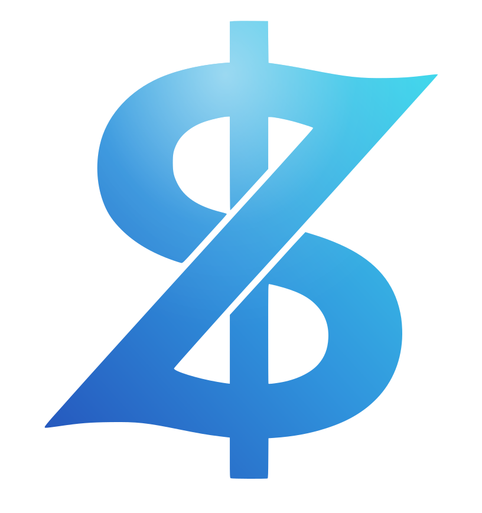
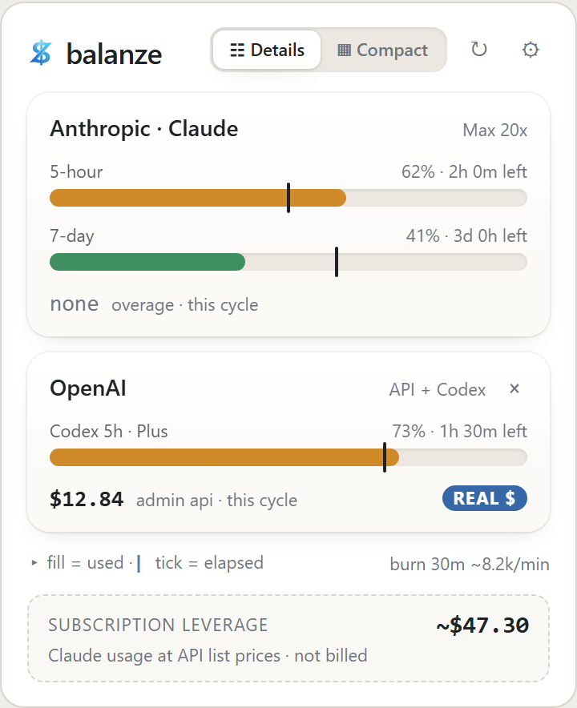
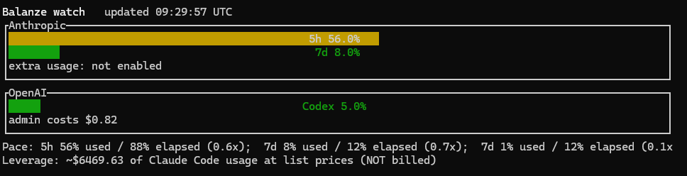

<p align="center">
  <picture>
    <source media="(prefers-color-scheme: dark)" srcset="docs/src/assets/logo-white.svg">
    
  </picture>
</p>

<h1 align="center">Balanze</h1>

<p align="center">
  <a href="https://github.com/Oszkar/balanze/actions/workflows/ci.yml"></a>
  <a href="https://github.com/Oszkar/balanze/releases"></a>
  <a href="LICENSE"></a>
  <a href="Cargo.toml"></a>
  <a href="https://oszkar.github.io/balanze/"></a>
</p>

<p align="center">
  A local-first tray utility that consolidates personal AI usage into one normalized view - Claude subscription quota, an estimate of Claude Code's API-rate value, OpenAI Codex quota, and real OpenAI API spend, all at a glance.<br>
  Rust + Tauri 2 + Svelte 5. Windows 11 (x64) and macOS 15+ (Apple Silicon); the CLI also runs on Linux.
</p>

> Not affiliated with, endorsed by, or sponsored by Anthropic or OpenAI. Reads only endpoints and files you already have access to with your own credentials.

<p align="center">
  <picture>
    <source media="(prefers-color-scheme: dark)" srcset="docs/src/assets/popover-dark.png">
    
  </picture>
</p>
<p align="center"><sub>The tray popover - quota per cadence with a pace tick, real billed spend badged as such, and the subscription-leverage estimate kept deliberately outside the grid.</sub></p>

<p align="center">
  
</p>
<p align="center"><sub><code>balanze-cli watch</code> - a live, bounded TUI showing Anthropic and OpenAI usage side by side.</sub></p>

## What it does

Balanze surfaces one normalized snapshot two ways - the `balanze-cli` CLI and the tray popover above. Both render the same data, and that data holds **measured reality only** - server-reported quota % and real billed $ - so every cell in a column is the same *kind* of number:

|               | Quota %                              | API $ (real billed)                                 |
|---------------|--------------------------------------|-----------------------------------------------------|
| **Anthropic** | OAuth usage (5h / 7-day / per-model) | `extra_usage` overage if you enabled it, else *n/a* |
| **OpenAI**    | Codex CLI rate-limit % (5h / weekly) | real billed spend (Admin Costs API)                 |

The Claude list-price figure is deliberately **not** a matrix cell - it sits outside the grid as a separate *Subscription leverage* insight, so a counterfactual estimate can never be mistaken for billed spend.

- **Anthropic quota** - the same `/api/oauth/usage` endpoint Claude Code uses: live 5-hour / 7-day / per-model bars with `resets_at` clocks. No scraping.
- **Anthropic API $ - real or nothing.** Anthropic exposes no per-user API spend, so this cell shows the real `extra_usage` overage *if* you enabled it on claude.ai, and otherwise reads **not available** - never backfilled with a substitute number.
- **OpenAI Codex quota** - the server-computed rate-limit % for both rolling windows (5-hour and weekly), read from the local Codex CLI rollout files (`~/.codex/sessions/`).
- **OpenAI API $** - this-month spend plus a per-line-item breakdown from `/v1/organization/costs`, using an `sk-admin-...` key. Real billing data.
- **Subscription leverage (a separate estimate)** - `claude_cost` multiplies your local Claude Code JSONL by a vendored LiteLLM price table to show what that usage *would* cost at API list prices. For Pro/Max users that is leverage from the subscription, **never billed**.

Roadmap and phase detail live in [`docs/PRD.md`](docs/PRD.md); architecture and the twelve boundaries in [`docs/ARCHITECTURE.md`](docs/ARCHITECTURE.md); release history in [`CHANGELOG.md`](CHANGELOG.md); code discipline in [`AGENTS.md`](AGENTS.md); user-facing answers in the [FAQ](https://oszkar.github.io/balanze/faq.html) and developer traps in [`docs/TROUBLESHOOTING.md`](docs/TROUBLESHOOTING.md); security posture in [`docs/SECURITY.md`](docs/SECURITY.md).

**Full documentation:** [oszkar.github.io/balanze](https://oszkar.github.io/balanze/) - install detail, the user guide, the CLI reference, and the FAQ.

## Install

**Desktop app (tray popover):** download from [GitHub Releases](https://github.com/Oszkar/balanze/releases/latest) - no Rust toolchain required.

| Your machine | Download | First run |
|---|---|---|
| macOS 15+, Apple Silicon | `Balanze_<version>_aarch64.dmg` | Signed and notarized - Gatekeeper should not warn. |
| Windows 11, x64 | `Balanze_<version>_x64_en-US.msi` | Unsigned - SmartScreen warns once, see below. |

The `_x64-setup.exe` asset is the same Windows app as an NSIS installer instead of an MSI; pick either. `_aarch64.app.tar.gz` is the raw macOS app bundle for scripted installs - if you are not sure, take the DMG.

Architecture caveats, checksum verification, and the from-source route are on the docs site: [Install](https://oszkar.github.io/balanze/install.html).

**Intel Macs are not supported.** The macOS build is Apple Silicon (arm64) only.

<details>
<summary><strong>Windows: what SmartScreen shows, and why</strong></summary>

You will see **"Windows protected your PC - Microsoft Defender SmartScreen prevented an unrecognized app from starting."** Verify the checksum first (see [Install](https://oszkar.github.io/balanze/install.html#verifying-a-download)), then click **"More info"** and **"Run anyway"**.

This means Windows does not recognize the publisher. It does not mean the installer is malware. Balanze is unsigned because a code-signing certificate would not fix it: Microsoft [no longer grants SmartScreen reputation for EV certificates](https://learn.microsoft.com/en-us/windows/apps/package-and-deploy/smartscreen-reputation), so a signed build from a project this size warns on first run too. The reasoning is recorded in [the PRD](docs/PRD.md#code-signing).

Rather than ask you to trust a certificate, the offer is: the source is public and builds from scratch (see [Develop](#develop)), and every release ships SHA-256 checksums so you can verify the download is byte-for-byte what CI produced.

</details>

### Command-line tool

`balanze-cli` is the full four-quadrant view in your terminal, the Claude Code statusline backend, and the entire Linux story.

| Platform | Install |
|---|---|
| macOS (Apple Silicon) | `brew install oszkar/balanze/balanze-cli` |
| Linux (x64) | `brew install oszkar/balanze/balanze-cli`, or download `balanze-cli-*-x86_64-unknown-linux-musl.tar.gz` |
| Windows (x64) | Download `balanze-cli-*-x86_64-pc-windows-msvc.zip` |
| Windows (arm64) | Download `balanze-cli-*-aarch64-pc-windows-msvc.zip` |

Extract the archive and put `balanze-cli` on your PATH. Every archive ships a sibling `.sha256`. Full detail - Linux and musl, the macOS quarantine flag, building from source, and what the Claude side needs - is in [Install](https://oszkar.github.io/balanze/install.html#command-line-tool).

For a full walkthrough - first run, reading the popover, connecting OpenAI, wiring the statusline - see the [**user guide**](https://oszkar.github.io/balanze/GUIDE.html).

## Using the CLI

`balanze-cli` is the headless surface and the reference composition the tray popover renders. It is a clap-derive multi-command tool; bare `balanze-cli` (no subcommand) defaults to `status`.

```text
balanze-cli                     4-quadrant compact status (the default; colored on
                                a TTY, honors NO_COLOR / --no-color)
balanze-cli status --sections   per-source detail (cadence bars, model breakdown,
                                Codex 5h + weekly windows, OpenAI line items)
balanze-cli status --json       machine-readable Snapshot JSON
balanze-cli watch               live TUI on a TTY; streams one JSON doc per line
                                when piped or given --json
balanze-cli doctor [--offline]  per-integration diagnostics (OK/WARN/FAIL + hint);
                                --offline skips the network key check
balanze-cli export [-o file]    stateless CSV of usage history, re-derived from JSONL
                                each run (nothing persisted)
balanze-cli setup               interactive wizard - run this first
balanze-cli statusline          Claude Code statusLine command
```

Every command, flag, exit code, and environment variable is documented in the [CLI Reference](https://oszkar.github.io/balanze/cli.html). Scripting against it? See [Exit codes](https://oszkar.github.io/balanze/cli.html#exit-codes).

## Develop

Prerequisites: Rust 1.89+ (all you need for the CLI); Bun 1.3+ (only for the Svelte popover frontend / `tauri dev`). Local builds use the Rust 1.94.0 toolchain pinned in `rust-toolchain.toml` (rustup picks it up automatically; CI uses the same version), and the repo pins Bun 1.3.13 via the `packageManager` field in `package.json`.

**TypeScript 7 is intentionally deferred.** Svelte's language tooling needs TypeScript's programmatic API to type-check `.svelte` files, which TypeScript 7.0 does not yet provide, so Balanze stays on TypeScript 6. See Microsoft's [TypeScript 7.0 announcement](https://devblogs.microsoft.com/typescript/announcing-typescript-7-0/).

```bash
# CLI from the workspace:
cargo run --release -p balanze_cli -- status

# Full workspace checks:
cargo test --workspace
cargo clippy --workspace --all-targets -- -D warnings
bun run check                                  # svelte-check + tsc

# Desktop app - gauge tray icon + live popover:
bun install                                    # also installs git hooks (see below)
bun run tauri dev

# States gallery (dev-only) - every screen and cell state on one canvas:
bun run gallery                                # standalone CSR gallery on :1430
```

**States gallery (dev-only).** `bun run gallery` opens a standalone page (port 1430) showing every popover screen and cell state at once - cold start, the OpenAI connect CTA, fetch errors, stale windows, billed overage, the settings panel - in both light and dark, rendered with the real Svelte components and `theme.css` tokens. It is a SvelteKit-free CSR page with no Tauri host (IPC is stubbed and every write is a no-op, so it can't touch your keychain or settings). `bun run gallery:snap` captures the states with Playwright. Source: `gallery.html` + `src/gallery-main.ts` + `src/lib/gallery/`.

`bun install` runs `lefthook install` (skipped without `.git/`), wiring `commit-msg` (Conventional Commits - blocking), `pre-commit` (rustfmt + svelte-check) and `pre-push` (clippy + tests) so the gates CI enforces fail locally first. Bypass one commit with `git commit --no-verify`, or `LEFTHOOK=0` for a session.

**`default-members = ["crates/*"]`:** bare `cargo build`/`test`/`run` skip `src-tauri`, so a CLI build never needs GUI libraries. The desktop app is the explicit opt-in (`cargo build --workspace` or `bun run tauri dev`) and pulls in the platform GUI stack:

- **Windows:** WebView2 runtime + VS Build Tools (no GTK - Tauri uses WebView2).
- **macOS:** Xcode Command Line Tools.
- **Debian/Ubuntu:** `sudo apt install libwebkit2gtk-4.1-dev libgtk-3-dev libayatana-appindicator3-dev librsvg2-dev build-essential libssl-dev libglib2.0-dev pkg-config`

If you only want the CLI on Linux, never run a `--workspace` build and you will never see a `gdk-3.0`/`pango`/`cairo` error.

### Finding your way around

The workspace is a set of small, single-responsibility crates under `crates/`: one HTTP client per provider, one keychain wrapper, one actor that owns state. The twelve boundaries that keep them honest are spelled out in [`docs/ARCHITECTURE.md`](docs/ARCHITECTURE.md); the short version:

- **Provider connectors** - `anthropic_oauth`, `openai_client`, `codex_local`, and `claude_parser` (the Claude JSONL wire format) each own one source. Adding a provider means a new connector crate wired into the `SnapshotSources` fetches that `snapshot_composer::compose` orchestrates (plus the watcher/coordinator for live updates) - the normalized `Snapshot` and the actor stay put. That connector abstraction is the design's central bet.
- **Domain math** - `window` (rolling-window + pace) and `claude_cost` (the pure list-price estimate). Pure functions, no I/O, tested first.
- **Composition + glue** - `snapshot_composer` (one-shot) and `state_coordinator` (the live actor) both assemble the same `Snapshot`; `balanze_cli` and `src-tauri` are thin glue over them, never logic.

Hitting a wall? [`docs/TROUBLESHOOTING.md`](docs/TROUBLESHOOTING.md) collects the non-obvious traps (double tray icons, JSONL CPU spikes, Tauri dep-version mismatches). Test discipline and the per-crate validation matrix live in `AGENTS.md` §6-§7.

## Contributing

Not actively soliciting contributions yet - this is a personal tool first. Found a bug or want to discuss design? Open an issue. Sending a PR anyway? Read `AGENTS.md` and `docs/ARCHITECTURE.md` first; they codify the architectural boundaries and code-discipline rules.

## License

MIT - see `LICENSE`.
