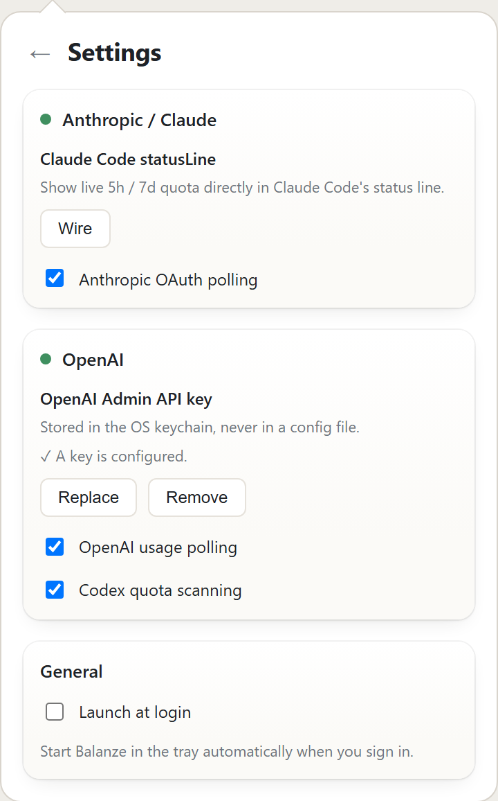
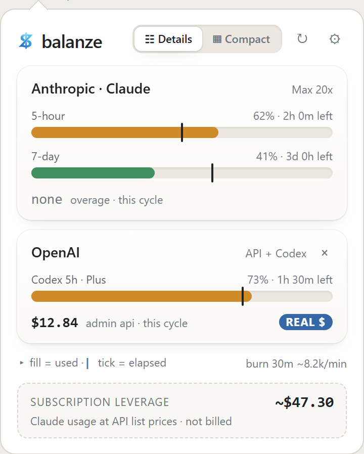
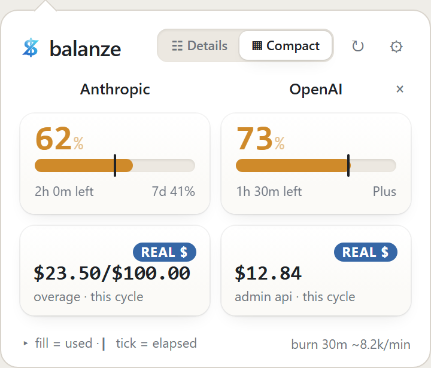
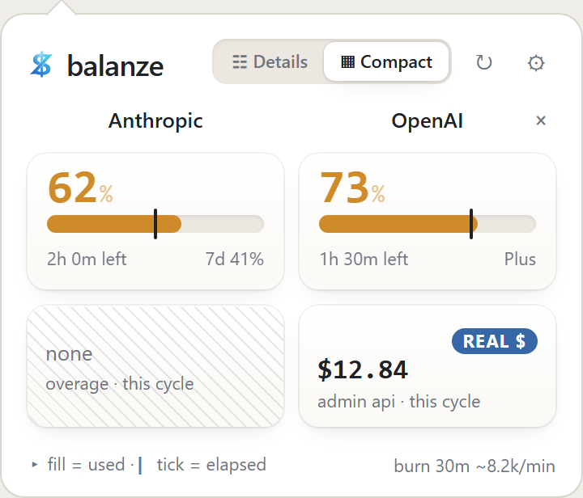
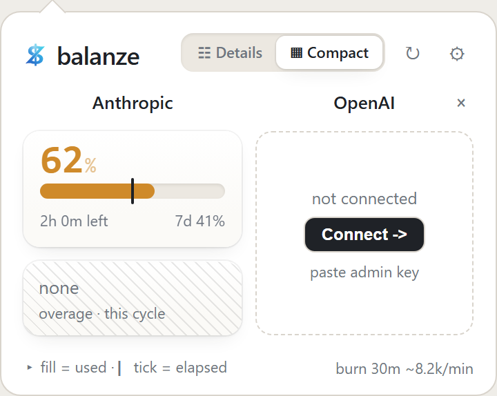

# Balanze user guide

A walkthrough of the desktop app and the CLI: first run, reading the popover, connecting OpenAI, the Claude Code statusline, and the states you might run into.

New here? Start with the [Introduction](index.md) for what Balanze is and how to install it. This guide picks up after install.

## First run

1. Install per [Install](install.md), or launch the desktop app.
2. Run `balanze-cli setup`. The wizard walks through the OpenAI Admin key and offers to wire the Claude Code statusline.
3. The Claude side needs no setup if Claude Code is already configured - Balanze reads its OAuth credential directly.

On the desktop app, first launch auto-opens the popover and fires a notification so the tray icon is easy to find.



*The settings panel after setup, keys in place.*

## Reading the popover

The popover is one normalized snapshot of your AI usage. Everything in the grid is **measured reality only** - a server-reported quota % or a real billed dollar amount - so a column never mixes kinds of numbers.



*The default Details view, Anthropic and OpenAI side by side.*

### The matrix

|               | Quota %                              | API $ (real billed)                                 |
|---------------|--------------------------------------|-----------------------------------------------------|
| **Anthropic** | OAuth usage (5h / 7-day / per-model) | `extra_usage` overage if you enabled it, else *n/a* |
| **OpenAI**    | Codex CLI rate-limit % (5h / weekly) | real billed spend (Admin Costs API)                 |

- **Anthropic quota %** - fresh local Claude Code statusline quota first, with `/api/oauth/usage` as fallback, with a reset clock on each bar. This selection is shared by the tray, watch, and one-shot status.
- **OpenAI quota %** - the Codex CLI rate-limit % for both rolling windows (5-hour + weekly, classified by duration), read from your local Codex rollout files.
- **OpenAI API $** - this-month billed spend from the Admin Costs API.
- **Anthropic API $** - real or nothing. If you enabled pay-as-you-go "Extra usage" on claude.ai, this cell shows that real overage; otherwise it reads **not available** (Anthropic exposes no per-user API spend). It is never backfilled with an estimate.



*The Anthropic billed cell showing a real overage amount.*

### Subscription leverage (a separate estimate)

Below the grid, the **Subscription leverage** box shows what the current calendar month's Claude Code usage *would* cost at API list prices (local JSONL times a vendored price table). For Pro/Max users this is leverage from the subscription, **never billed** - so it sits outside the matrix, where it can't be mistaken for spend.

### Pace and burn

- **Pace** rides on the usage bar: how much of a window you have used versus how far through the window you are. Over 1.0x means you are ahead of pace. Balanze shows measured pace, not a forecast - an earlier version tried an EWMA-based predictor, but a plausible-looking forecast that's occasionally wrong is worse than a fact that's always right, so it was retired in favor of this.
- **Burn** is the recent token rate for the active Claude session.

### Source and confidence

Cells carry a badge for real billed money so you can tell it apart from an estimate at a glance. Hover any cell for its source and confidence.

### Details vs Compact

A density toggle switches between the default **Details** view and a **Compact** grid - same data, less room per provider.



*The Compact grid.*

## The tray icon

The tray gauge is a color-shifting ring on one shared scale - **green / yellow / orange / red at 50 / 75 / 90** - used identically across the tray, popover, CLI, and statusline. The ring colors on your **worst** window, and the title and tooltip name which window that is, so the color is always explained by a number you can see. Before there is any data the gauge is neutral, and the tooltip reads "connecting..." while a source warms up or "... unavailable" when one is not configured.

## Connecting OpenAI

OpenAI spend and Codex quota need an OpenAI **Admin** key (`sk-admin-...`), created in your OpenAI org's API-key settings. A regular `sk-...` key will not reach the Admin Costs API.

Provide it any of these ways:

- `balanze-cli setup` or `balanze-cli set-openai-key` (masked prompt).
- The popover's settings panel (Set / Replace / Remove). The key is validated before it is saved, and stored in your OS keychain - never written to disk in plaintext.
- The `BALANZE_OPENAI_KEY` env var (handy for CI or a locked keychain; takes precedence over the keychain).

Until a key is present, the OpenAI column shows a connect prompt rather than a blank cell.



*The "add OpenAI" affordance before a key is set.*

## The Claude Code statusline

Balanze can put live quota straight in your Claude Code prompt (the [CLI Reference](cli.md) has the full reference).

- **Wire it** during `balanze-cli setup`, or from the popover's settings panel.
- **Replace, don't wrap.** If another tool already owns the `statusLine.command`, Balanze offers to replace it *with your consent*, backing the previous command up first. Nothing in the other tool's own config is touched.
- **Restore** the previous command at any time with `balanze-cli statusline restore` (or the settings panel).

## States you might see

Balanze names each situation instead of blanking a cell - cold start, "not detected", a stale window, a fetch error. Each one is described with a screenshot in the [FAQ](faq.md#states-you-might-see).

## The CLI in brief

The CLI renders the same snapshot headlessly:

- `balanze-cli` - the compact 4-quadrant status (colored on a TTY).
- `balanze-cli watch` - a live TUI (streams JSON when piped or given `--json`).
- `balanze-cli doctor` - per-integration diagnostics with actionable hints.
- `balanze-cli export -o usage.csv` - a stateless CSV re-derived from JSONL.

Run `balanze-cli help` (or `--help` on any subcommand) for the full reference, and see the [CLI Reference](cli.md) for the exit-code taxonomy and JSON schema.

## Settings

The popover's gear opens settings:

- **Keys** - set / replace / remove the OpenAI Admin key.
- **Provider toggles** - enable or disable each provider live; a disabled provider's cell clears instead of going stale.
- **Statusline** - wire, unwire, or restore the Claude Code statusline.

## Linux

Balanze on Linux is the CLI only - there is no tray app. See [Install](install.md#command-line-tool) for how to get the binary on your PATH.

There is no OS credential store wired on Linux, so `balanze-cli set-openai-key` cannot save a key and will tell you so. Supply the key through the environment instead:

```bash
export BALANZE_OPENAI_KEY=sk-admin-...
```

This variable takes precedence over the keychain on every platform, so it is also the escape hatch if a macOS or Windows keychain is locked. Once it is set, `balanze-cli doctor` reports the keychain line as OK and names the env var as the source. With no key configured, that line is a warning rather than a failure, because a missing store on Linux is the expected state and not a fault. The overall run can still fail: `doctor` reports a failure when *no* provider source is usable, which is what a freshly installed box with no Claude, no Codex, and no key looks like.

Neither provider needs a secret that Balanze manages. Codex quota and the Claude JSONL figures come from local files those tools already write. Anthropic quota uses Claude Code's own OAuth credential, which Balanze reads in place and never modifies - so it works once you have run `claude login`, with nothing extra to set up here.

## Troubleshooting

If something looks wrong, `balanze-cli doctor` diagnoses each integration with a hint per source. Common questions and their answers are in the [FAQ](faq.md).
