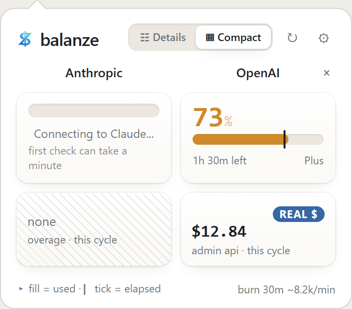
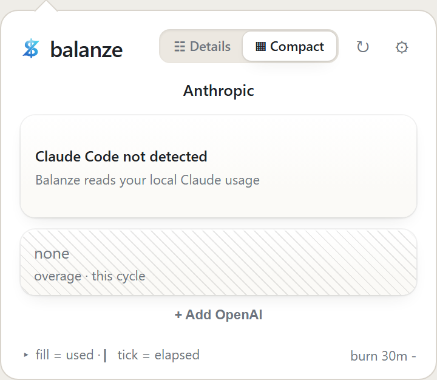
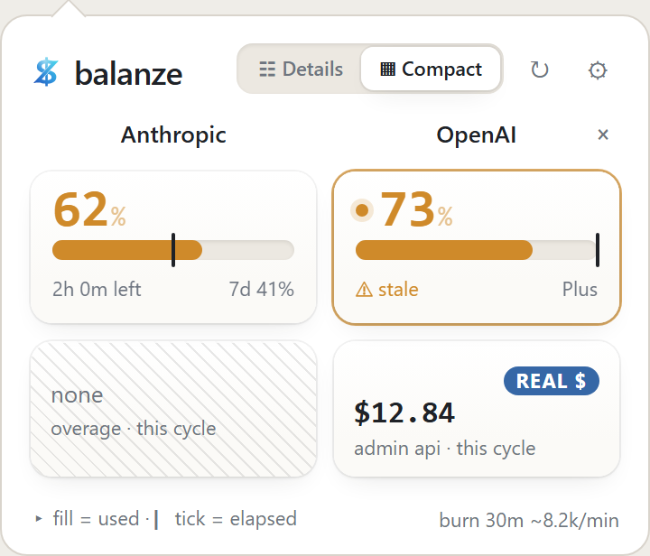
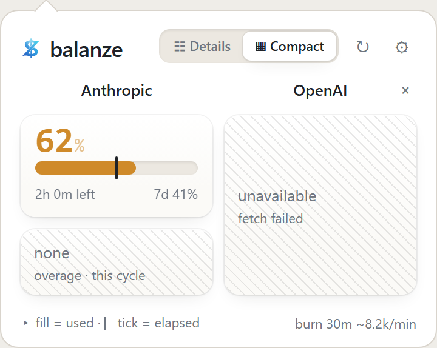

# FAQ & Troubleshooting

Start with `balanze-cli doctor`. It checks each integration and prints a hint per source, which answers most of what follows.

If you are looking for the developer-facing traps (Tauri dependency pinning, the dev-server hang, parser internals), those live in [`docs/TROUBLESHOOTING.md`](https://github.com/Oszkar/balanze/blob/main/docs/TROUBLESHOOTING.md) in the repository.

## States you might see

Balanze names each situation instead of blanking a cell.

- **Cold start** - a source is still connecting.
  
- **Claude Code not detected** - a neutral "not configured" state, not an error. The tray stays neutral and raises no warning.
  
- **Stale window** - a window that already reset degrades to a `stale` marker rather than showing a confidently-wrong number.
  
- **Fetch error** - a failed source shows an error placeholder and raises the degraded-state banner naming the affected source.
  

## The tray icon is missing, duplicated, or flickering

None of these are configurable, and none are caused by anything you did. They are bugs in the build you are running. Please [file an issue](https://github.com/Oszkar/balanze/issues/new) with your OS and version and the Balanze version from `balanze-cli --version`.

## The statusline is wired but my Claude Code prompt is blank (Windows)

Almost always the `statusLine.command` path in `~/.claude/settings.json` uses backslashes. Two things mangle it at once: JSON reads `\b` and `\t` as control characters, and Claude Code runs the status line through Git Bash, where a backslash escapes. Both fail silently, so you get an empty line rather than an error.

Use forward slashes, which are valid in Windows file APIs, JSON, and Git Bash simultaneously:

```json
"command": "C:/Users/you/path/to/balanze-cli.exe statusline"
```

If `balanze-cli` is on your `PATH` (which it is after any of the [Install](install.md) routes), the bare form avoids the problem entirely:

```json
"command": "balanze-cli statusline"
```

## Codex and OpenAI segments appear in my statusline even though the app is not running

That is expected, not a bug. When no fresh snapshot exists, `balanze-cli statusline` composes those segments itself: Codex comes from local files, and OpenAI cost is fetched and cached for five minutes - and only when your configured line actually contains `{openai_cost}`, which the default template does not. At most one upstream OpenAI request fires per five minutes across every concurrent prompt.

Starting the desktop app or `balanze-cli watch` produces a fresh snapshot, which takes precedence.

## Balanze is using a lot of CPU while Claude Code is active

It should not: the JSONL reader is incremental and re-reads only what was appended. Sustained high CPU means that has regressed. Please [file an issue](https://github.com/Oszkar/balanze/issues/new) noting roughly how large `~/.claude/projects` is.

## My OpenAI key is rejected

The OpenAI cells need an **Admin** key (`sk-admin-...`), created in your organization's API-key settings. A regular `sk-...` key cannot reach the Admin Costs API and will be refused. `balanze-cli doctor` distinguishes the two.

## Claude data stopped updating

Balanze reads Claude Code's OAuth credential strictly read-only and never refreshes it. When it expires, re-run:

```bash
claude login
```

Balanze picks the refreshed credential up on its next poll. It never writes, mirrors, or backs up that credential.

## macOS keeps asking for Keychain permission

Builds you compile yourself are unsigned, so macOS cannot reliably remember an "Always Allow" grant across rebuilds. The release DMG is signed and notarized and does not have this problem. See [Install](install.md).
